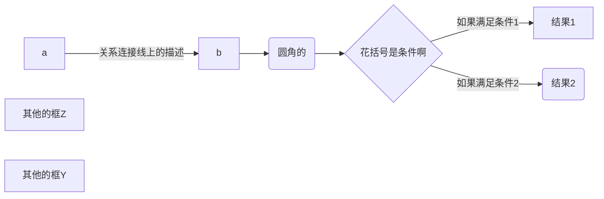
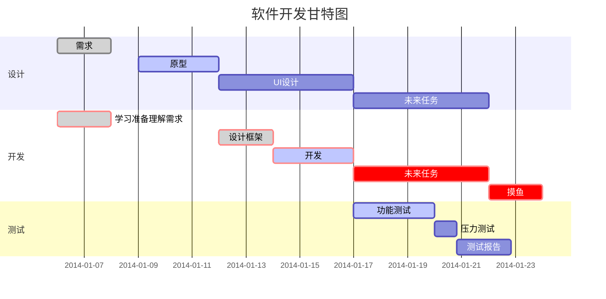

### 1.markdown是简单的符号语法,使得它作为纯文本也可以发布.

***
### 2.同时又兼容html,可以直接在文档中插入html,不需要额外标注这是html或者这是md.
#### 2.1 html区块元素,比如 `<div>`、`<table>`、`<pre>`、`<p>` 等标签,使用时前后都要空一行,且需要在顶格使用.块标签的内容没有md语法.
#### 2.2 html的区段（行内）标签如 `<span>`、`<cite>`、`<del>` 可以在 Markdown 的段落、列表或是标题里随意使用

<table>
    <tr>
        <th>name</th>
	<th>description</th>
    </tr>
    <tr>
        <td>scookie</td>
	<td>smart cookie</td>
    </tr>
</table>

***
### 3.标题
#### 3.1 Setext 形式
H1 content 等于号需要超过2个
==
H2 content 减号需要超过2个
--
#### 3.2 Atx 形式,支持1-6 级标题
# H1
## H2
### H3
#### H4
##### H5  

***
### 4.引用
>引用内容,很长很长很长很长很长很长很长很长很长很长很长很长很长很长很长很长很长很长很长很长很长很长很长很长很长很长很长很长很长很长很长很长很长很长的引用内容可以省略换行的引用符号">"
>
>>嵌套引用是这样的,多个">"
>
>#引用的H1内容
>1. 列表项1
>2. 列表项2
>引用结束要空一行

***
### 5.强制换行,敲两个空格,然后回车就行,或者是空一行
我等下要换行  
了

***
### 6.列表
#### 6.1 无序列表,[*,+,-符号 空格 内容]
   * content1前面最多可以有三个空格
     再写一点内容,依然很清爽很好看
* content2
再写一点,对不对齐最后都会对齐
+ content3
+ content4
- content5
- content6

#### 6.2 有序列表[数字 英文句号 空格 内容]
   1. content1前面可以最多有三个空格
   3. content2
   4. content3
   
1. 你发现没虽然我的序号明明是错误的渲染出来却是正确的
#### 6.3 列表中的引用
* 段落1
  
  >引用
* 段落2
>无缩进时该引用不会被引用在列表中
* 段落3
  
  >引用

#### 6.4 列表中的多个段落
* 第一个列表项
  段落2
  段落3很长很长  
长到换行也是允许的

  段落4空一行也是可以的,保证缩进一个制表符
  

段落5如果换行了没有空一个制表符可不行

* 另一个列表项

#### 6.5 列表中的代码
* 第一个列表项,下一行有代码,代码要缩进两个制表符
  
  <pre>abc    def</pre>
* 第二个列表项,没有缩进两个空格就不行
  
<pre>abc    def</pre>
* 第三个列表项

#### 6.6 特殊的情况,行首出现[数字 句点 空白]就会被当作是列表,可以在句号前加反斜杠
1986. 不是列表项却被当成了列表项

1986\. 不是列表项,就不是列表项

#### 6.7 嵌套列表
* 父级
	* 子级
	* 子级
		* 再子集

#### 6.8 列表引用
* 第一项
	>引用
	>引用
* 第二项
	>引用
	>引用

***
### 7.字体
*斜体*
_斜体_
**粗体**
__粗体__
***粗斜体***
___粗斜体___

***
### 8.分割线divider,在空白的一行里三个以上的星号,减号,下滑行,中间可以插入空格
***
*  *       *   *
-        -    - -
___
_ _     _

***
### 9.下滑线借助html的`<u>`标签
<u>下滑线</u>

***
### 10.删除线
~~删除线~~

***
### 11.脚注,脚注要放在同行有文字的地方
创建一个脚注[^脚注]

[^脚注]:脚注的释义

***
### 12.代码
#### 12.1 段落中的一个函数或者片段代码用(`)
一个`echo()`函数
#### 12.2 代码区块就用一个制表符/四个空格
	let a=0,b=1;
	let c=a;
	a=b;
	b=c;
#### 12.3 带有指定或者不指定语言的代码片段```
```
let a=0,b=1;
let c=a;
a=b;
b=c;
```
```javascript
let a=0,b=1;
let c=a;
a=b;
b=c;
```
***
### 13.超链接
#### 13.1 普通的用法是[链接名称](链接地址)或者<链接地址>
[袋鼠云](https://www.dtstack.com)
<https://www.dtstack.com>

#### 13.2 高级的用法是用([变量])来代替地址,文档末尾附上变量地址
例如[袋鼠云][dtstack]
例如[西瓜][scookie]

[dtstack]:https://www.dtstack.com
[scookie]:https://github.com/Scookie/code-log/blob/master/README.md

***
### 14.图片
#### 14.1 开头一个感叹号,接着一个方括号,里面放上图片未请求到的替代文本,接着一个圆括号里面放上图片地址,还可以用引号包住并加上title文字~~我并没有看出title有什么用~~


#### 14.2 变量,链接地址放在末尾
![袋鼠云][dtstackIcon]
[dtstackIcon]:https://www.dtstack.com/wp-content/themes/daishuyun/images/favicon.ico
#### 14.3 如果要设置宽高那就用


***
### 15.表格
#### 15.1 用`|`来分割单元格,用`-`来分割表头和其他行
|name|value|
|----|-----|
|pro | 15  |
|mac | 16  |
#### 15.2 对齐方式用`-:`设置内容和标题栏右对齐,`:-`设置内容和标题左对齐,`:-:`设置内容居中对齐
|name左对齐|value右对齐| key居中对齐 |
|:---|----:| :-: |
|pro | 15  | a   |
|mac | 16  | b   |

***
### 16.反斜杠转译
|符号|意义|
|---|:--|
|*|星号|
|\\|反斜杠|
|`|反引号|
|_|下划线|
|{}|花括号|
|[]|方括号|
|()|圆括号|
|#|井号|
|+|加号|
|-|减号|
|.|英文句号|
|!|英文感叹号|

***
### 17.流程图
#### 17.1 基本流程图,从左到右,从上到下,每一行字可以描述一个关系

#### 17.2 标准流程图,*注意冒号后面要有一个以上的空格*
```flow
st=>start:  开始框
op=>operation: 处理框
cond=>condition: 判断框(是或否?)
sub1=>subroutine: 子流程
io=>inputoutput: 输入输出框
e=>end: 结束框
st->op->cond
cond(yes)->io->e
cond(no)->sub1(right)->op
```
```flow
a=>start: start
b=>operation: operation1
c=>condition: condition(left or right)
d=>operation: operation2
e=>subroutine: sub
f=>inputoutput: input
g=>inputoutput: output
h=>end: end
a(right)->f(right)->b(right)->c
c(yes)->g->h
c(no)->d->e(right)->b


```
#### 17.3 UML时序图,*时序图例子,-> 直线，-->虚线，->>实线箭头*
```sequence
前端-->后端: 给点数据
Note right of 后端: service client
Note left of 前端: javascript
后端-->服务A: 我要数据A
后端-->服务B: 我要数据B
Note over 服务A,服务B: 一堆微服务
Note over 服务B,服务C: 一堆微服务
服务A->后端: 给你数据A
服务B->后端: 给你数据B
后端->前端: 呐,你要的数据
服务C->>前端: 服务C的自我意识觉醒,传数据给前端,箭头不一样呢
服务C-->>前端: 服务C的自我意识觉醒,传数据给前端,箭头和线都不一样呢
participant 参与者服务D
```
#### 17.4 甘特图*section分块,每一个任务后面是[冒号/crit(关键)/逗号/down状态/逗号/名称变量/逗号/开始时间/逗号/结束时间/after desc2/逗号/几天]*,冒号后面至少跟一项时间,其他的可填可不填

